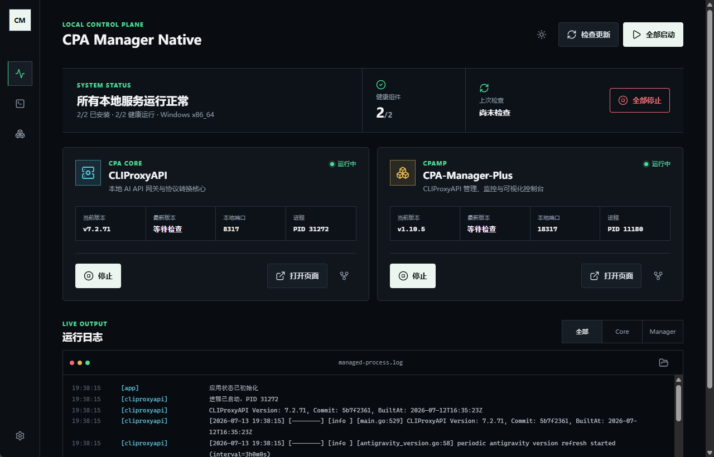
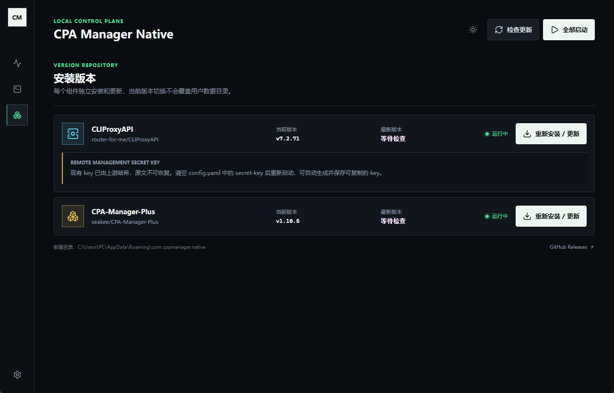
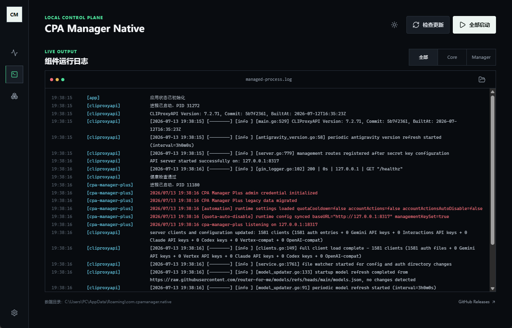
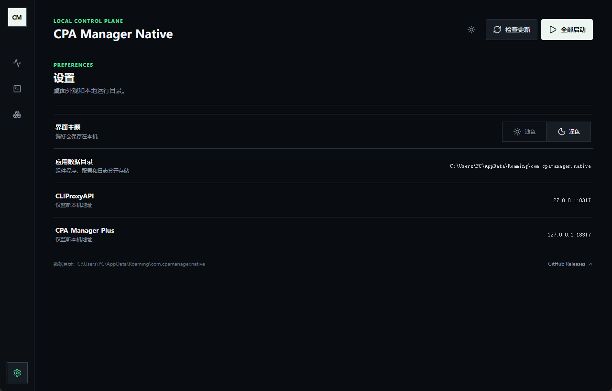

<div align="center">


# CPA Manager Native

**面向 CLIProxyAPI 与 CPA-Manager-Plus 的原生桌面管理器**

在一个本地 Tauri 桌面应用中完成安装、更新、运行、监控和回滚。

[](https://tauri.app/)
[](https://www.rust-lang.org/)
[](https://react.dev/)
[](https://www.typescriptlang.org/)
[](https://github.com/gcdd1993/CPA-Manager-native/releases)

<sub>关键词：CLIProxyAPI 管理器 · CPA-Manager-Plus 桌面外壳 · 本地二进制管理 · Tauri 桌面应用</sub>

[English](README.md) · **简体中文**

</div>

---

CPA Manager Native 是一个桌面控制台，用于把 [CLIProxyAPI](https://github.com/router-for-me/CLIProxyAPI) 和 [CPA-Manager-Plus](https://github.com/seakee/CPA-Manager-Plus) 作为本地托管二进制程序运行。

它不是 CPA-Manager-Plus 的替代品，而是围绕上游组件提供稳定的原生桌面外壳：Release 查询、校验和验证、安装、启动、健康检查、日志、数据目录管理和回滚都可以在同一个界面中完成。

## 适用场景

- 希望一键本地启动 CLIProxyAPI 和 CPA-Manager-Plus 的用户。
- 希望用托盘型桌面应用管理服务，而不是手动维护终端进程的用户。
- 需要通过校验和、健康检查和回滚降低升级风险的用户。
- 希望在托管服务就绪后再打开 CPA-Manager-Plus Web 管理页的用户。

## 不适用场景

- 它不是 CLIProxyAPI 或 CPA-Manager-Plus 的 fork 或替代实现。
- 它不是托管服务，也不是远程管理平台。
- 它不会在后台轮询 GitHub 更新；更新检查为手动触发，以避免 GitHub API 限流噪音。

---

## 核心功能

#### 托管安装

- 从 GitHub Releases 查询 CPA Core 和 CPA-Manager-Plus 的最新版本。
- 匹配 Windows、macOS 和 Linux 的平台专属 Release 资产。
- 激活前使用上游 `checksums.txt` 校验下载文件。
- 保留近期安装版本，启动失败时可以回滚到上一可用版本。

#### 本地进程控制

- 在桌面界面中启动和停止每个已安装组件。
- CPA Manager Native 启动后自动拉起已安装组件。
- 桌面应用退出时自动停止托管组件。
- 启动托管服务前检查端口占用。

#### 健康检查与恢复

- 对预期本地端口执行服务健康检查。
- 健康检查通过后打开 CPA-Manager-Plus 管理页。
- 展示运行日志、进程 ID、组件状态、进度和错误信息。
- 新版本启动健康检查失败时，在存在旧版本的情况下自动回滚。

#### 配置与密钥

- 将应用设置保存在用户的 `~/.cpamanager-native` 目录。
- 使用可配置的数据目录保存托管组件二进制、manifest、日志和配置。
- 当上游配置中的 CLIProxyAPI 远程管理密钥为空时，自动生成并持久化密钥。
- 在独立的“WebDAV 同步”页面手动上传或恢复本程序、CPA Core 和 CPA-Manager-Plus 的配置。同步采用文件白名单，不包含组件程序、版本目录、日志或下载缓存；恢复前会在固定配置目录创建本地备份。
- 在已安装版本视图中显示可恢复的管理密钥。
- 保留已有的上游哈希密钥，不暴露也不轮换。

#### 桌面体验

- 默认关闭到托盘；从托盘菜单显式退出。
- 可选开机自启动。
- 支持浅色和深色主题。
- 本地运行时管理，本项目不包含遥测。

<div align="center">

| 主仪表盘 | 已安装版本 |
| --- | --- |
|  |  |

| 健康与日志 | 托盘菜单 |
| --- | --- |
|  |  |

</div>

---

## 安装

从 [Releases](../../releases) 下载对应平台的安装包。

| 平台 | 发布包 |
| --- | --- |
| Windows x64 | NSIS 安装器 |
| macOS Apple Silicon | `.app`、`.dmg` |
| macOS Intel | `.app`、`.dmg` |
| Linux x64 | `.deb`、`.rpm` |

除非发布流水线配置了签名密钥，否则发布资产默认未签名。macOS 首次启动未签名构建时，可能需要在系统安全设置中手动允许。

## 快速开始

1. 安装并打开 CPA Manager Native。
2. 选择或确认用于保存托管组件二进制和配置的数据目录。
3. 在仪表盘中安装 CPA Core 和 CPA-Manager-Plus。
4. 从应用中启动两个组件。
5. 等待健康检查通过，然后打开 CPA-Manager-Plus 管理页。

CPA-Manager-Plus 会被配置为连接 `http://127.0.0.1:8317` 上的 CLIProxyAPI。

## 托管组件

| 组件 | 简称 | 作用 | 默认端口 |
| --- | --- | --- | --- |
| CLIProxyAPI | CPA Core | 本地 AI API 网关与协议转换核心 | `8317` |
| CPA-Manager-Plus | CPAMP | Web 管理、监控与可视化控制台 | `18317` |

## 平台支持

| 运行平台 | 托管资产匹配 | 应用发布包 |
| --- | --- | --- |
| Windows x64 | `windows_amd64.zip` | NSIS 安装器 |
| macOS Apple Silicon | `darwin_aarch64` / `darwin_arm64` 归档 | `.app`、`.dmg` |
| macOS Intel | `darwin_amd64` 归档 | `.app`、`.dmg` |
| Linux x64 | `linux_amd64.tar.gz` | `.deb`、`.rpm` |

## 已知兼容性说明

- CPA-Manager-Plus `v1.11.0` Windows amd64 版本会在 SQLite 启动阶段因 `SQL logic error: out of memory (1)` 退出，因此会被跳过。见 [seakee/CPA-Manager-Plus#345](https://github.com/seakee/CPA-Manager-Plus/issues/345)。
- Linux 安装包基于 Ubuntu 22.04 和 WebKitGTK 4.1 依赖构建，遵循 Tauri v2 的 Linux 打包要求。

---

## 技术栈

- **桌面外壳**：Tauri 2
- **后端**：Rust、Tokio、reqwest
- **前端**：React、TypeScript、Vite
- **打包**：Tauri bundler 与 GitHub Actions
- **发布集成**：GitHub Releases、SHA-256 校验和验证

## 开发

环境要求：

- Node.js 22
- Rust stable
- 各平台对应的 Tauri 构建依赖

安装依赖：

```bash
npm ci
```

运行前端开发服务器：

```bash
npm run dev
```

运行 Tauri 应用：

```bash
npm run tauri -- dev
```

构建前端：

```bash
npm run build
```

运行 Rust 检查：

```bash
cargo fmt --manifest-path src-tauri/Cargo.toml -- --check
cargo clippy --locked --manifest-path src-tauri/Cargo.toml -- -D warnings
cargo test --locked --manifest-path src-tauri/Cargo.toml
```

## 打包

推送 `v*` tag 或手动启动发布工作流时，GitHub Actions 会构建发布包。

Windows 版本支持应用内原地更新。顶部“检查更新”会同时检查 CPA Manager Native 和托管组件；发现新版应用后，可下载签名的 NSIS 更新包并以 `/UPDATE` 模式覆盖当前安装，保留应用数据、快捷方式和开机自启设置，无需先卸载。

本地打包示例：

```bash
# Windows
npm run tauri -- build --bundles nsis

# macOS
npm run tauri -- build --bundles app,dmg

# Linux
npm run tauri -- build --bundles deb,rpm
```

Linux 打包需要 WebKitGTK 4.1 依赖和相关打包工具：

```bash
sudo apt-get update
sudo apt-get install -y libwebkit2gtk-4.1-dev libappindicator3-dev librsvg2-dev patchelf xdg-utils libfuse2 rpm
```

## 发布流程

1. 更新 `CHANGELOG.md`。
2. 确保 `package.json`、`package-lock.json`、`src-tauri/Cargo.toml`、`src-tauri/Cargo.lock` 和 `src-tauri/tauri.conf.json` 中的版本一致。
3. 运行验证命令。
4. 提交发布元数据。
5. 创建并推送 annotated tag：

```bash
git tag -a vX.Y.Z -m "CPA Manager Native vX.Y.Z"
git push origin master
git push origin vX.Y.Z
```

自动更新包必须使用固定的 Tauri updater 私钥签名。发布仓库需要配置以下 GitHub Actions Secrets：

- `TAURI_SIGNING_PRIVATE_KEY`：与 `tauri.conf.json` 中公钥配对的私钥内容。
- `TAURI_SIGNING_PRIVATE_KEY_PASSWORD`：私钥密码；无密码密钥可留空。

私钥不得提交到仓库。丢失私钥后，已安装版本将无法验证后续更新包。

## 项目结构

```text
src/        React 前端
src-tauri/  Tauri/Rust 后端、安装器、进程管理、Release 解析
assets/     README 截图和文档资产
PRD/        产品说明与设计参考
.github/    CI、发布工作流和 Dependabot 配置
```

## 隐私与数据

- CPA Manager Native 自身设置保存在 `~/.cpamanager-native`。
- 托管二进制、manifest、日志和上游组件配置保存在所选数据目录。
- 只有在安装或手动检查更新时，应用才会从 GitHub Releases 下载发布元数据和资产。
- 本项目不包含遥测，也不依赖托管后端。

## 致谢

CPA Manager Native 管理上游项目 [CLIProxyAPI](https://github.com/router-for-me/CLIProxyAPI) 和 [CPA-Manager-Plus](https://github.com/seakee/CPA-Manager-Plus)。这些项目遵循各自的许可证和发布流程。

## 友情链接

- [Linux DO](https://linux.do/) - 面向技术与开源爱好者的社区。
